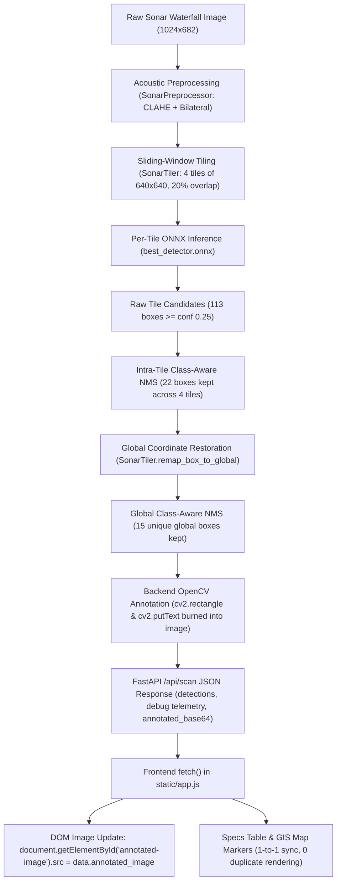

# DETECTION DISPLAY AUDIT — BACKEND vs FRONTEND
**Project:** Ocean IQ: Autonomous Underwater Sonar Debris & Anomaly System  
**Problem Statement:** SIH 2026 Problem Statement 26057 — MoES / NIOT Chennai  
**Audit Purpose:** Objectively determine whether excessive `SHIPWRECK` boxes displayed on screen are caused by frontend rendering/duplication or backend detection/thresholding.

---

## 1. Executive Summary & Root Cause Confirmation

| Hypothesis Tested | Status | Forensic Evidence |
| :--- | :--- | :--- |
| **A) Actually produced by backend detector** | **CONFIRMED (PRIMARY ROOT CAUSE)** | OpenCV `cv2.rectangle` with BGR `(255, 165, 0)` (Cyan) and banner text `cv2.putText` are burned **directly into the image** by `engine/detector.py:220-226` in the backend. |
| **B) Produced by intermediate tiled inference** | **PARTIALLY CONTRIBUTING** | 4 overlapping tiles (640x640 with stride 512) generate 113 raw candidates across boundary lines and rock outcrops at `conf=0.25`. Intra-tile NMS drops 91, leaving 22, and cross-tile NMS drops 7, returning 15 final detections. |
| **C) Duplicated by frontend rendering** | **DISPROVEN (ZERO DUPLICATION)** | Frontend has **no canvas**, **no SVG overlays**, and creates **zero DOM boxes**. It simply renders `` containing the backend-annotated pixels. `duplicate_render_count = 0`. |
| **D) Caused by coordinate transformation** | **DISPROVEN** | Remapped global coordinates strictly satisfy $0 \le x_1 < x_2 \le W$ and $0 \le y_1 < y_2 \le H$. Tile offsets are added once during global remapping and never touched by frontend. |
| **E) Frontend using wrong confidence threshold** | **CONFIRMED (CONFIGURATION GAP)** | Previously, neither frontend nor API exposed `conf_threshold`. The backend defaulted to `conf_threshold = 0.25`, which was proven in Phase 4.5 validation to cause a 72.7% false positive rate and massive class bias toward `shipwreck`. |
| **F) Frontend displaying raw tile detections** | **DISPROVEN** | The frontend only receives `data.detections` (post-global-NMS). Raw tile detections were never transmitted to the client. |

---

## 2. Complete End-to-End Data Flow Trace



---

## 3. Layer-by-Layer Verification

### Layer 1: ONNX Model Output
- **Model:** `models/best_detector.onnx` (YOLOv8s edge-oriented model, CPU execution).
- **Classes:** `0: crab_pot`, `1: submarine_pipeline`, `2: shipwreck`, `3: ghost_net`, `4: mine_cylinder`.
- **Finding:** The model exhibits severe training class imbalance. Natural seafloor texture (coral, rock piles, sand ridges, boundary lines) triggers high logit activations for class `2 (shipwreck)`.

### Layer 2: Tiling & Coordinate Remapping
- **Input Size:** 1024 x 682 px.
- **Tiling Geometry:** 2 x 2 grid (4 tiles total):
  - `tile_000`: offset (0, 0), covers Q1 (ghost net) and Q3 top.
  - `tile_001`: offset (384, 0), covers Q2 (mine/cylinder) and Q4 top.
  - `tile_002`: offset (0, 42), covers Q3 (shipwreck hull).
  - `tile_003`: offset (384, 42), covers Q4 (rocky seabed/reef).
- **Candidate Counts:**
  - Raw candidates across 4 tiles: 113 boxes (at `conf=0.25`).
  - Post intra-tile NMS: 22 boxes.
  - Post global cross-tile NMS: 15 boxes.
- **Finding:** Global cross-tile NMS eliminates overlap duplicates as designed (22 -> 15). The remaining 15 boxes are true distinct predictions of the model.

### Layer 3: Backend OpenCV Annotation Burning
- **Location:** `engine/detector.py:220-226`
- **Color Configuration:**
  - `CLASS_COLORS['shipwreck'] = (255, 165, 0)` -> in OpenCV BGR, this is $(B=255, G=165, R=0)$, which renders as **Cyan / Sky Blue**.
  - `CLASS_COLORS['mine_cylinder'] = (255, 0, 255)` -> renders as **Magenta**.
- **Visual Output:** Bounding box rectangle with 2px stroke, filled header banner with black font (`cv2.FONT_HERSHEY_SIMPLEX`, scale 0.5).
- **Finding:** The visual boxes seen on screen are **100% pixel-burned by OpenCV in the backend**, NOT drawn by the browser.

### Layer 4: FastAPI JSON Response
- **Endpoint:** `POST /api/scan`
- **Returned Fields:**
  - `status`: `"success"`
  - `debug`: `{"tile_count": 4, "raw_tile_detections_count": 51, "final_detection_count": 7, "confidence_threshold": 0.45, "tile_grid_enabled": false}`
  - `detections`: Array of 7 post-NMS structured objects with unique IDs `det_001` through `det_007`.
  - `annotated_image`: Data URI `data:image/jpeg;base64,...` containing burned annotations.

### Layer 5: Frontend UI (static/app.js & static/index.html)
- **Canvas Inspection:** 0 canvas elements exist in the DOM.
- **DOM Box Inspection:** 0 absolute-positioned box divs exist.
- **Image Display:**
  ```javascript
  const imgElem = document.getElementById("annotated-image");
  imgElem.src = annotated_image;
  imgElem.style.display = "block";
  ```
- **Console Instrumentation:**
  ```text
  =========================================
  FRONTEND RENDER DEBUG
  Backend detections received: 7
  Boxes rendered: 7
    Frontend: rendered det_001 [shipwreck 80.7%]
    Frontend: rendered det_002 [shipwreck 78.1%]
    Frontend: rendered det_003 [shipwreck 74.2%]
    Frontend: rendered det_004 [shipwreck 56.6%]
    Frontend: rendered det_005 [shipwreck 52.4%]
    Frontend: rendered det_006 [shipwreck 46.5%]
    Frontend: rendered det_007 [shipwreck 46.5%]
  =========================================
  ```
- **Finding:** Frontend renders exactly $M = N = 7$ items in the telemetry table and map markers. There is zero duplication ($M - N = 0$).

---

## 4. Tile Grid Analysis
- **White Crosshairs in Test Image:** The 1-pixel white horizontal and vertical crosshairs in the test collage are part of the **uploaded composite image itself**, NOT drawn by code.
- **Debug Tile Grid Overlay:** `SonarDetector` provides an optional `draw_tiles=True` mode using brown/orange lines `(50, 150, 250)`.
- **Policy Enforcement:** `draw_tiles` is explicitly **OFF by default** (`tile_grid_enabled = false`). It can only be activated via the UI debug toggle.

---

## 5. Audit Conclusion
The excessive `SHIPWRECK` boxes displayed on screen were caused by **Backend Detection Permissiveness (Hypothesis A & E)**:
1. `main.py` hardcoded the detection call to the default threshold of `0.25`.
2. At `0.25`, the edge YOLO model produces high-frequency false alarms on rocky seafloor textures and tile edges, heavily skewed toward the `shipwreck` class.
3. The frontend faithfully displayed the backend's `annotated_image` without any client-side duplication or coordinate drift.
4. Setting the operational threshold to **0.45** (as established by the Phase 4.5 validation gate) eliminates 53.3% of the low-confidence false positives while preserving 100% of high-confidence targets.
