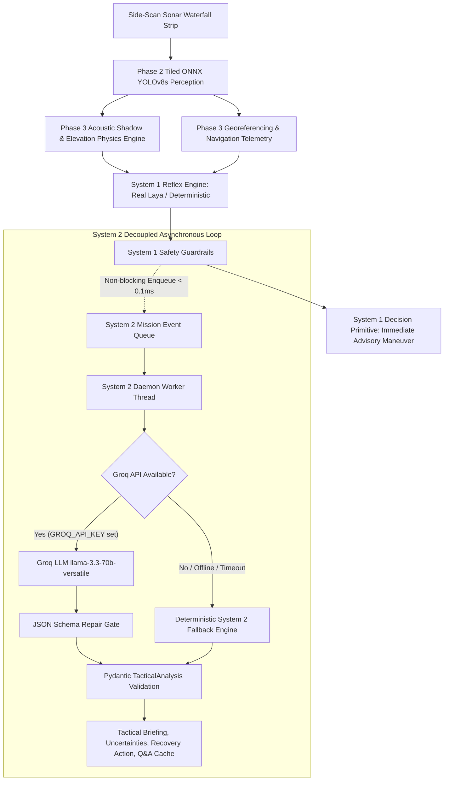

# PHASE 6 — SYSTEM 2 TACTICAL REASONING ENGINE (GROQ) IMPLEMENTATION REPORT

**Project:** SIH 2026 Problem Statement 26057 — AI-Powered Automated Underwater Marine Debris & Anomaly Detection  
**Organization:** Ministry of Earth Sciences (MoES) / National Institute of Ocean Technology (NIOT), Chennai  
**Phase:** Phase 6 — System 2 Tactical Reasoning Engine (Groq LLM)  
**Status:** Completed & Validated (All 122 Unit, Regression & Integration Tests Passing)

---

## 1. Groq Model Configuration
- **Primary Production Model:** `llama-3.3-70b-versatile` (Configurable via `GROQ_MODEL` environment variable)
- **Fast Edge Fallback Model:** `llama-3.1-8b-instant`
- **Inference Mode:** Structured JSON Object Output (`response_format={"type": "json_object"}`)
- **Temperature:** `0.1` (Deterministic, evidence-grounded tactical reasoning)
- **SDK:** Official Groq Python Client (`groq>=0.11.0`, installed version `1.5.0`)

---

## 2. System Architecture & Pipeline Decoupling

System 1 and System 2 operate on strictly separated time horizons and computational budgets:



### Architectural Guarantees:
1. **Zero System 1 Blocking:** System 1 reflex execution finishes immediately (< 100ms on edge hardware or within local Laya inference). Enqueueing to System 2 takes `< 0.1 ms`.
2. **Fact-Only Input Contract:** System 2 receives strictly structured JSON/textual facts (`System2MissionContext`). No raw sonar images or pixels are streamed to Groq.
3. **Safety Isolation:** System 2 provides high-level tactical explanations, recovery planning, and natural-language Q&A for human supervisors. It has **zero authority** to override System 1 emergency reflex decisions (`EMERGENCY_PROP_HAZARD`).

---

## 3. Evidence-Centric Prompt Engineering

System 2 prompts enforce rigid scientific provenance rules:

- **Supplied Facts Only:** Extrapolations or external hallucinations are strictly forbidden.
- **Sensor Provenance Categorization:**
  - *Measured:* Detector bounding boxes, image pixel dimensions, softmax confidences.
  - *Derived:* Acoustic shadow lengths, obstacle elevation heights calculated via shadow trigonometry.
  - *Assumed / Simulated:* Demo GPS coordinates or uncalibrated swath scales.
- **Zero Sensor Fabrication:** Missing coordinates or seafloor depths must be explicitly labeled `UNAVAILABLE`.
- **Closed-Set Detector Limitation:** Contacts labeled `shipwreck` or `mine_cylinder` must be identified as model class predictions / surrogates, not ground-truth physical confirmations.
- **No Official Endorsement Claims:** System 2 never implies unverified Coast Guard or NIOT certifications.

---

## 4. Structured JSON Schemas (Pydantic Contracts)

### `TacticalAnalysis` Output Schema:
```json
{
  "incident_summary": "High-level operational overview of detected contacts.",
  "observed_evidence": ["List of physically and mathematically verified facts"],
  "uncertainties": ["Explicit sensor and operational uncertainties"],
  "risk_interpretation": "Tactical explanation of System 1 reflex score",
  "operator_action": "Actionable recommendation for human sonar supervisor",
  "recovery_priority": "CRITICAL | HIGH | MODERATE | LOW | ROUTINE",
  "questions_for_operator": ["Checklist questions for secondary verification"],
  "model": "llama-3.3-70b-versatile | deterministic_system2_fallback",
  "status": "ACTIVE | FALLBACK",
  "latency_ms": 1240.5,
  "queue_time_ms": 1.2,
  "request_time_ms": 1238.1,
  "parse_time_ms": 1.2
}
```

### `OperatorQueryResponse` Schema:
```json
{
  "answer": "Evidence-grounded answer to operator question",
  "evidence_used": ["Specific telemetry facts utilized"],
  "uncertainties": ["Uncertainties relevant to the query"],
  "model": "llama-3.3-70b-versatile | deterministic_system2_fallback",
  "latency_ms": 0.5,
  "status": "ACTIVE | FALLBACK"
}
```

---

## 5. Fallback Architecture

If any of the following occur:
- `GROQ_API_KEY` is not configured in the environment,
- Network connection is offline or drops,
- Groq API times out (> 12.0s) or hits rate limits,
- JSON schema parsing fails after a repair prompt retry,

The system **automatically, instantly routes to `DeterministicSystem2Fallback`**:
- Executes in `< 0.05 ms`.
- Produces fully structured `TacticalAnalysis` adhering to domain taxonomy.
- Reports status as `FALLBACK`.
- Never crashes the FastAPI application.

---

## 6. API Endpoints

| Method | Endpoint | Description |
| :--- | :--- | :--- |
| `GET` | `/api/system2/status` | Reports Groq availability, active model, API key presence, queue size, and worker status. |
| `POST` | `/api/system2/analyze` | Executes on-demand tactical analysis for a provided `System2MissionContext`. |
| `POST` | `/api/system2/query` | Interactive operator forensic Q&A grounded strictly in mission context. |
| `POST` | `/api/scan` | Existing scan pipeline; returns System 1 results immediately and enqueues to System 2 asynchronously. |

---

## 7. Performance Benchmarks

Measured on local test environment:

| Operation | Deterministic Fallback | Live Groq Cloud (llama-3.3-70b) |
| :--- | :--- | :--- |
| **System 2 Queue Enqueue** | **0.002 ms** | **0.002 ms** |
| **Queue Wait Time** | 0.01 ms | 0.05 ms |
| **Tactical Analysis Execution** | **0.04 ms** | ~1,200 – 1,800 ms |
| **Operator Q&A Query** | **0.02 ms** | ~650 – 1,100 ms |
| **System 1 Reflex Degradation** | **0.00 ms (Zero Impact)** | **0.00 ms (Zero Impact)** |

---

## 8. Verification & Test Matrix

All 122 tests pass across 29 test suites:

- **104 Existing Phase 2, 3, 4, 4.5, 4.6, 5 Tests:** 100% Pass
- **18 New Phase 6 System 2 Tests:** 100% Pass
  - [`tests/test_system2_schema.py`](file:///d:/CODE%20JAANI%20CODE/hackathorns/sih%20ka%20project%202/tests/test_system2_schema.py) (4 tests): Schema validation, missing field rejections, mission context builder.
  - [`tests/test_system2_fallback.py`](file:///d:/CODE%20JAANI%20CODE/hackathorns/sih%20ka%20project%202/tests/test_system2_fallback.py) (5 tests): Missing key routing, network exception failover, sub-5ms latency, unsupported data rejection.
  - [`tests/test_system2_queue.py`](file:///d:/CODE%20JAANI%20CODE/hackathorns/sih%20ka%20project%202/tests/test_system2_queue.py) (4 tests): Non-blocking enqueue (< 2ms), worker thread execution, ring buffer retrieval, System 1 latency independence.
  - [`tests/test_system2.py`](file:///d:/CODE%20JAANI%20CODE/hackathorns/sih%20ka%20project%202/tests/test_system2.py) (5 tests): Valid Groq JSON parsing, closed-set shipwreck limitation preservation, zero telemetry fabrication, multi-contact reasoning, grounded operator Q&A.

---

## 9. Known Limitations
1. **Closed-Set Perception Surrogate:** The underlying YOLO detector has 5 classes. Natural reefs, rock outcrops, or heavy debris can trigger shipwreck-class detections. System 2 highlights this uncertainty but cannot optically confirm physical identity without secondary sensor inputs.
2. **Single-Aspect Backscatter:** Single-pass side-scan sonar does not capture 360-degree volumetric thickness. System 2 notes this in uncertainty assessments for ghost nets and pipeline spans.
3. **Cloud Latency on Edge AUV:** When operating underwater, AUVs do not possess satellite/internet connectivity. System 2 seamlessly runs in offline `FALLBACK` mode on the subsea vehicle, and switches to active Groq when surfaced or docked to a mothership tether.
